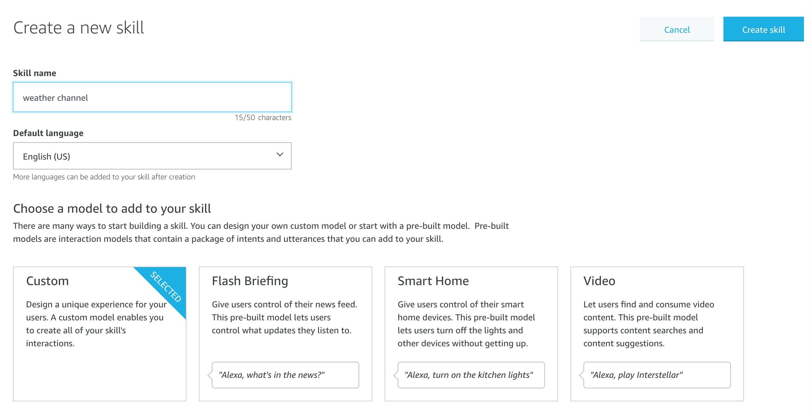
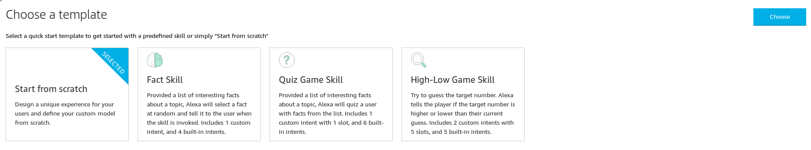
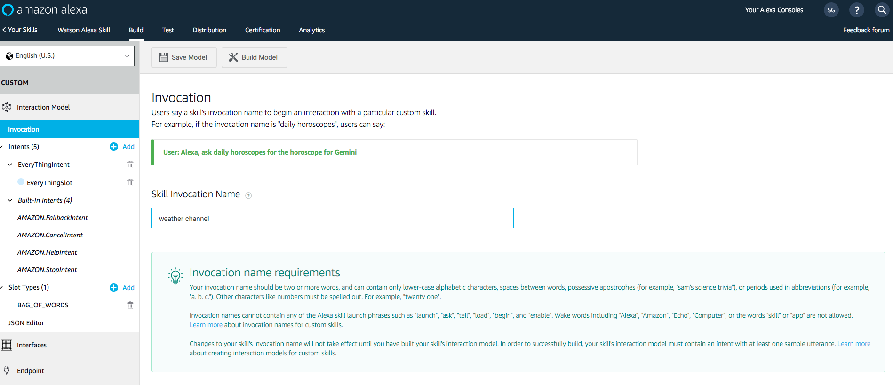
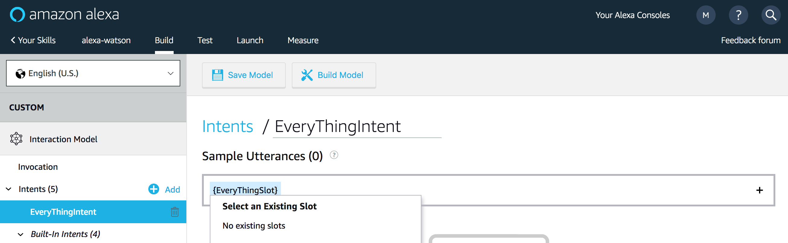
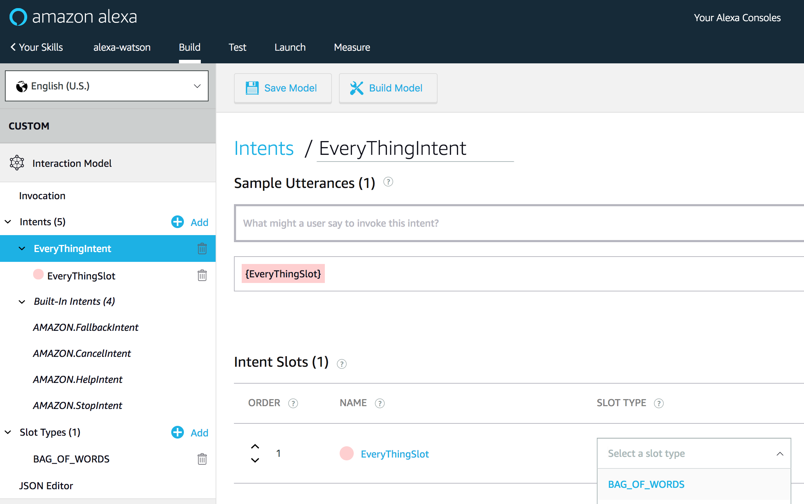
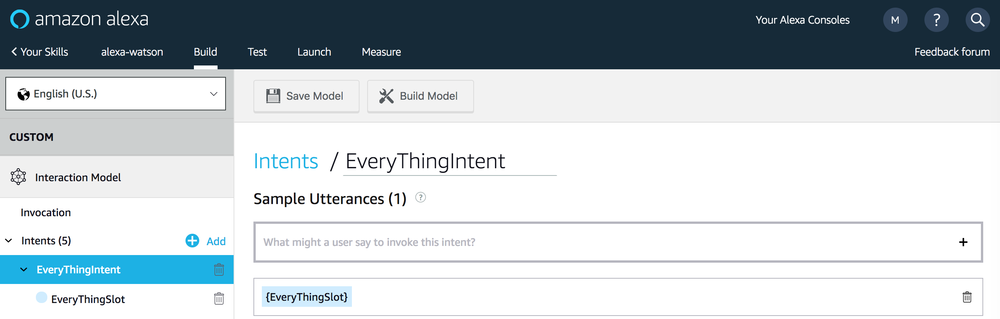

# Creating an Amazon Alexa Skill

### Background

[Alexa](https://developer.amazon.com/alexa) is Amazon's cloud-based voice service. Most people are familiar with the service through using an [Amazon Echo or Echo dot](https://developer.amazon.com/alexa/echo) but the service can also be integrated in to custom internet-connected devices like this talking robotic fish:

[](https://www.youtube.com/watch?v=bRxhgxH6FUI)

When building a skill for Alexa there are two components - the **skill interface** and the **skill service**.

The **skill interface** processes the speech that comes in from a device. It uses [natural language processing](https://en.wikipedia.org/wiki/Natural_language_processing) to determine the intent of the user and then passes this as a JSON object to the skill service. It also passes JSON responses back in to voice to the user or device.

The **skill service** is the part that actually executes the functionality of your skill. It accepts the JSON from the skill interface, does some stuff, then returns a JSON object back to the skill interface where it can be converted to speech. For our example we are using IBM Functions as our skill service and the Amazon dev platform as our skill interface.

### Creating the skill

#### Getting set up

Before we can create a new Alexa skill we need to create an Amazon developer account:

1. Sign up for an Amazon Developer Account [here](https://developer.amazon.com/).

2. Go to https://developer.amazon.com/alexa/console/ask and click the `Create Skill` button


3. Put in the name `Business Strategy Generator` and choose **custom** as the model then hit the `create skill` button.



4. Select **start from scratch** and click the `choose` button.



#### Configuring the skill

The skill **invocation name** is what a user will say to an Alexa device to trigger our skill. To make this as realistic as possible, lets change ours to "senior management", so that our skill will be invoked by the phrase "Alexa, ask senior management..."

1. Click on `Invocation` on the left navigation and change the Skill Invocation Name to `senior management` and click `Save Model` (in the top left corner).



When you start to build more complex Alexa skills, you need to define the *intents* that your user can utter. An *intent* is essentially a general action a user can perform e.g. "what is the forecast?" or "get my balance!". Since our skill doesn't handle multiple actions we'll just create one intent that will handle all requests.

2. On the left side-bar click on `Slot Types` and hit `+ Add`:


3. Use the name `BAG_OF_WORDS` and hit the `Create custom slot type` button:


4. Now `BAG_OF_WORDS` needs a slot value. Just enter `Hello World` and hit the plus sign so that it has a slot value:


5. On the left side-bar click on `Intents` and click `+ Add`:


6. Use the name `EveryThingIntent` and hit the `Create custom intent` button.

7. Enter the text `{EveryThingSlot}` in to the text field under "Sample Utterances (0)" and click the plus sign to create the slot:



8. Scroll down to where it says `Intent Slots` and use the `Select a slot type` dropdown to select the value **BAG_OF_WORDS** for the EveryThingSlot:



9. Click on `Save Model` and then `Build Model` in the top left corner of the console:




### Updating your serverless action

Your Alexa skill is almost ready to use but right now it won't work even if we integrate it with our serverless action. The Alexa skill interface expects a JSON payload to be returned in a certain format for it to work. To do that, we'll need to modify our existing `generateStrategy` action:

1. Make a copy of your **generator.js** file and name it `alexa.js`

```
$ cp generator.js alexa.js
```

2. Open the new `alexa.js` file and modify the following `return` statement inside your `main()` function:

**Previously**
```javascript
return {
    "text": toTitleCase(statement)
}
```

**Now**
```javascript
return {
    "version": "1.0",
    "response": {
        "shouldEndSession": true,
        "outputSpeech": {
            "type": "PlainText",
            "text": toTitleCase(statement)
        }
    }
}
```

The functionality of our action hasn't changed but we're now returning our response in a format that will be accepted by Alexa. One important parameter is `shouldEndSession: true` which tells Alexa that we are finished conversing with the user.

3. Save your `alexa.js` file.

By default when you create actions on IBM Functions they are *private*. To allow our action to be called from the Alexa skill interface we need to make it *public*.

4. Create a new action called `alexaGenerateStrategy` and enable it for the web:

```
$ ibmcloud wsk action create alexaGenerateStrategy alexa.js --web true
ok: created action alexaGenerateStrategy
```

Using the `--web` flag with a value of `true` or `yes` allows an action to be accessible through a REST interface without the need for credentials. If you're interested in learning how to configure a web action with credentials see the [Securing web actions docs](https://cloud.ibm.com/docs/openwhisk?topic=cloud-functions-openwhisk_webactions#securing-web-actions). A web action can be invoked by using a URL that is structured as follows: `https://{APIHOST}/api/v1/web/{namespace}/{packageName}/{actionName}.{EXT}`.

The package name is **default** if the action is not in a named package.

5. Get your action public url:

```
$ ibmcloud wsk action get alexaGenerateStrategy --url
ok: got action alexaGenerateStrategy
https://eu-gb.functions.cloud.ibm.com/api/v1/web/edmundshee%40uk.ibm.com_dev/default/alexaGenerateStrategy
```

5. Try calling your web endpoint with a tool such as [curl](https://curl.haxx.se/) or [postman](https://www.getpostman.com/):

```
$ curl https://eu-gb.functions.cloud.ibm.com/api/v1/web/edmundshee%40uk.ibm.com_dev/default/alexaGenerateStrategy.json
{
  "response": {
    "outputSpeech": {
      "text": "We Are On A Journey To Objectively Seize Effective Core Competencies",
      "type": "PlainText"
    },
    "shouldEndSession": true
  },
  "version": "1.0"
```

*Note: if you add `.json` to the end of your url the platform will return a JSON object*

🎉🎉🎉 **Awesome work, you now have a web-enabled action that can be called from anywhere. Why not move on to integrate your action and finalise your Alexa skill...** 🎉🎉🎉

### Next Lab:
[Integrating and testing your skill](/labs/integrating-your-skill.md)