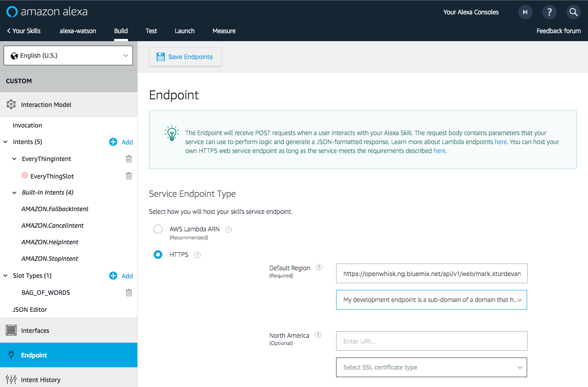
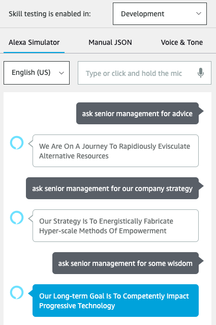

# Integrating your skill

Now that you've update your action to meet the JSON scheme that Alexa requires **and** enabled your action as a public endpoint, you're ready to integrate the two. For this you'll need to head back to the Amazon developer console.

### Setting up the integration

1. Click on `Endpoint` in the sidebar of your Alexa console.

2. Select `HTTPS` as the Service Endpoint Type.

3. For the Default Region enter the **HTTPS** service endpoint which is the URL of your IBM Cloud **Web Action** from earlier.

*Tip: you can find your url again by running the command:*
```
$ ibmcloud wsk action get alexaGenerateStrategy --url
ok: got action alexaGenerateStrategy
https://eu-gb.functions.cloud.ibm.com/api/v1/web/edmundshee%40uk.ibm.com_dev/default/alexaGenerateStrategy
```

**Don't forget to add the `.json` extension to the end of your url.**

4. Use the drop-down to select `My development endpoint is a sub-domain of a domain that has a wildcard certificate from a certificate authority`.

5. Click the `Save Endpoints` button!



### Testing your skill

1. Use the `Test` tab in the Amazon developer console.

2. Use the drop-down to enable your skill for testing in `Development`. You can type or talk and test the skill in the test UI.

> Once enabled, you can run the sample via Alexa enabled devices, or the [Echo simulator](https://echosim.io/).

3. Test your skill by asking Alexa for the `senior management` skill. Some examples you can use:
- Alexa, ask senior management for advice
- Alexa, talk to senior management
- Alexa, ask senior management about our company strategy
- Alexa, ask senior management how they plan to create sustained growth

*In reality, you can say anything you like after `senior management` because our skill doesn't have any intents. If you were going to enhance this skill the future though, it would be good to know what people are likely to ask.*



You can invite others to test it with the beta test feature. In order to be eligible for beta test, you must fill out most of the publishing information.

You probably shouldn't publish this example, but you are now ready to create and publish your own Alexa skill backed by IBM Cloud Functions.

🎉🎉🎉 **Congratulations. You've now successfully automated the jobs of the buzzword-loving executive and learned some great technology along the way.** 🎉🎉🎉

### Looking for more?
[Return to the main menu for additional learning resources](README.md)